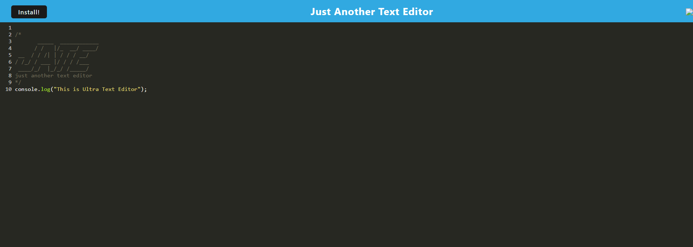

# Ultra-Text-Editor
## Description
This application helps the user create text files with a simple text editor, creating notes and any other ideas the user wants to implement.

[Go to Website here](https://intense-reef-45073-6413f9b741fa.herokuapp.com/)

## Installation
I created a repo in GitHub, which then cloned onto VS. Then I copied the Develop folder and transferred the files onto the ULTRA-TEXT-EDITOR repo. After having everything ready, I added the necessary folders along my coding journey.

## Usage
To use the application, the user can input anything into the editor. If they want to run the application on their device, they have the choice to install it and still preserve their latest inputs. 

## Credits
The University of Toronto,  
Ariana Vinamagua